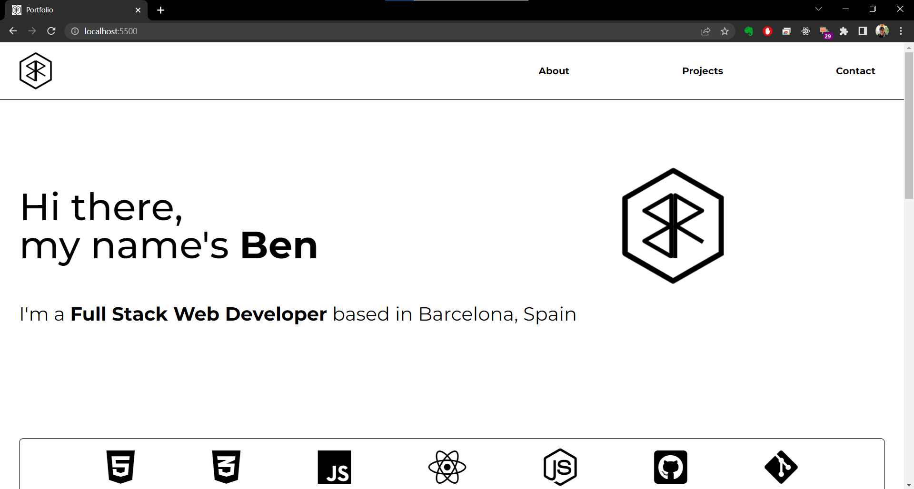

# Personal Portfolio

[Live Site](https://bright-souffle-5c1569.netlify.app/)

## About the project

---

This project was created whilst doing the Codecademy Full Stack Engineer Course. The objective was to create a simple portfolio page with an about and contact page. I decided to extend this to include several projects and also a small backend to add functionality to a contact form instead of a simple anchor with a mailto href. My idea was to keep the design clean and simple which is why the majority of the page is black and white. I used both FlexBox and CSS Grid to help with the layout to continue my practice.

### Built with

**Front End**

-   HTML
-   CSS
-   Javascript
-   Font Awesome
-   Hosted on Netlify

**Backend**

-   NodeJs
-   Express
-   Nodemailer
-   Mailgun
-   Hosted on Heroku

### What I learned from this project

I learned a big lesson with this project: keep your API keys safe. I accidentally pushed my Mailgun SMTP information to a public GitHub repository. This caused my Mailgun account to be suspended. I fixed this issue by first making my backend repository private and including a .env file with my keys. These keys were imported using the .dotenv. On Heroku I was able to set them as variables. I also learned about Cors. In fact, to get the backend to work I had to create my own Cors-Anywhere proxy, which is also hosted on Heroku.

### Next steps

-   Work on a color scheme to add more color to the page
-   Add a dedicated about section with WakaTime stats
-   Pagination for more projects.
